# SACRED

SACRED is a Soft Actor-Critic, Robust Evolutionary Deep reinforcement learning framework that
generates resilient, unpredictable routing policies for contested logistics operations. It was
developed and evaluated in an MSc thesis at Imperial College London (Kilian Schwarz, 2026).
This repository presents the project and its findings. It does not contain the source code.

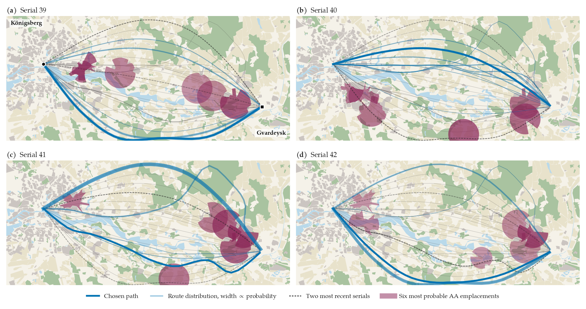

*Four consecutive serials in the Königsberg Oblast theatre. SACRED effectively anticipates where
the adversary is likely to emplace air defences.*

Resupply operations in contested environments confront a class of threat that conventional
logistics planning was never designed to address. When convoys travel repeatedly between bases
and the forward positions they resupply, they generate a Pattern of Life: an observable record
of routes, behaviours, and habits. A capable adversary intent on maximising the chance of
interception studies that record and commits its interdiction assets to the network in advance
of the next sortie. By the time the threat is observed the engagement has already occurred, so
the only viable defences are anticipation and unpredictability. A planner that reliably selects
the shortest route is intercepted with certainty in the worst case, precisely because its
behaviour can be predicted without error.

Adversarial Reinforcement Learning promises routing policies hardened by training against a
hostile opponent, yet the literature offers no systematic account of when that promise holds.
Instead of asking whether adversarial training works in a narrow domain, this project provides
a map, identifying the settings in which the approach demonstrably fails and is unnecessary and
those where adversarially-trained policies deliver unparalleled value.

## Principal findings

The central finding is that SACRED's calibrated unpredictability transfers zero-shot. Trained
adversarially on three cities, it beats every fixed strategy of a fourth at 0.639 ± 0.025 of
the static cap. Far from a trivial benchmark, this reference also bounds the optimal Nash
mixture an exact solver would produce. Thus, SACRED outperforms, in a single zero-shot attempt,
the absolute best static plan available. When an identical network was deprived of its memory,
its score dropped to a severely degraded 1.43, confirming that the ability to adapt to recent
history drives the entire performance gain.

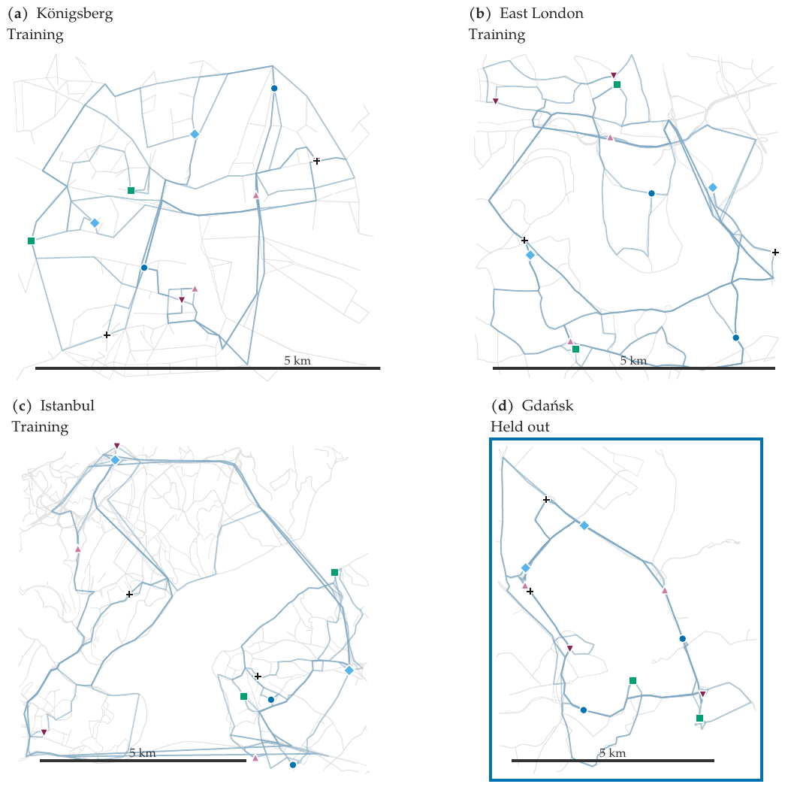

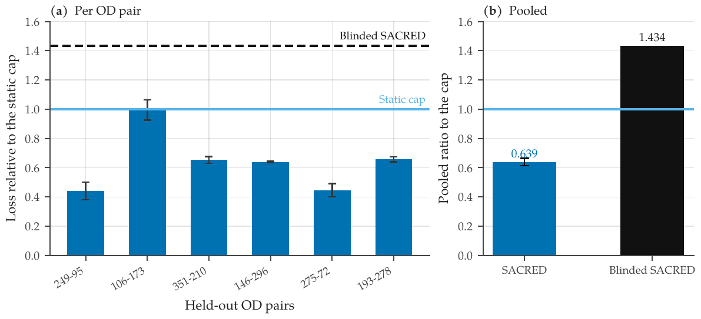

Learned policies are advantageous where computation fails. Against a Pattern-of-Life adversary,
SACRED ties the best heuristics at an interdiction budget of K=2 and beats every heuristic
across the remaining computable region, K=3 to K=6, with margins widening from 8.6 to 20.7%.
The best heuristics sit at around 1.55 times the exact optimum, translating to wide gaps that
are only filled by using SACRED. Once Nash equilibria become incomputable, learning provides
the only alternative for realising additional performance gains.

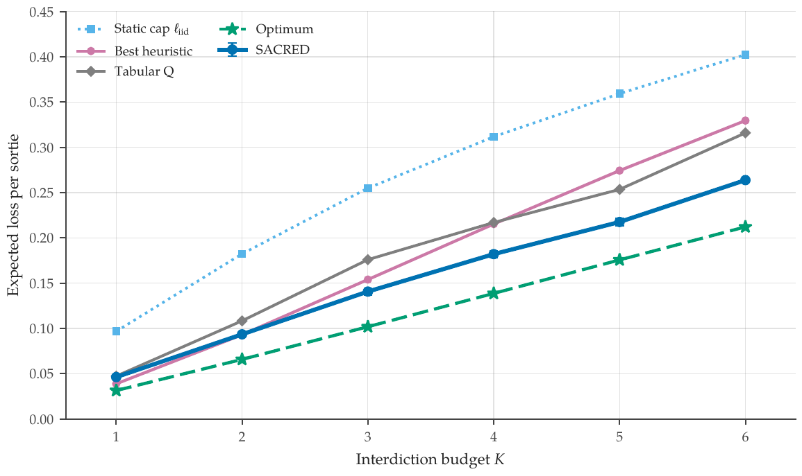

SACRED is not a panacean or universally efficacious policy, and the negative results garnered
throughout the thesis are reported transparently, serving to demarcate the exact problem
configurations where SACRED is highly performant. Adversarial training against congestion did
not condition successful policies, because congestion is observable and easily avoidable,
allowing reactive defenders to dominate. In interdiction games at low K budgets, randomisation
over edge-disjoint routes is often optimal or quasi-optimal and SACRED therefore unnecessary.

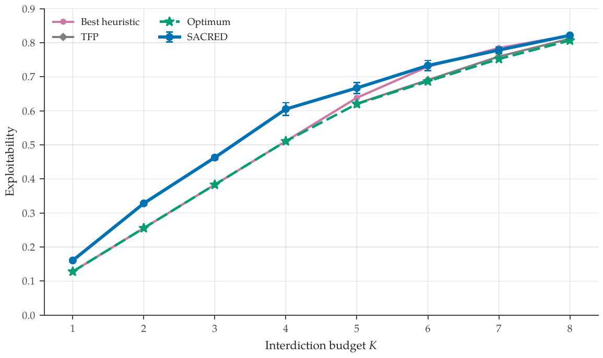

SACRED is highly generalisable, requiring only a route menu, a risk estimate per route, and its
own recent history. This means that the core mechanism was simply transferable to air-based
resupply missions. On the Königsberg to Gvardeysk map, it beat the static reference on all
eighteen cells, at 0.351 of this reference and 1.46 times the exact optimum in a zero-shot
attempt.

LLMs can be used to augment SACRED, resulting in measurable performance increases. While
Llama-3.3-70B and Qwen3.6-27B both fail as decision-making defenders, they can perfectly
categorise descriptions of enemy activity, which SACRED was ultimately unable to achieve alone.
LLMs reliably identify the right adversary even when contradictory information is presented, or
where keyword matching collapses. They are also highly effective training curriculum authors.

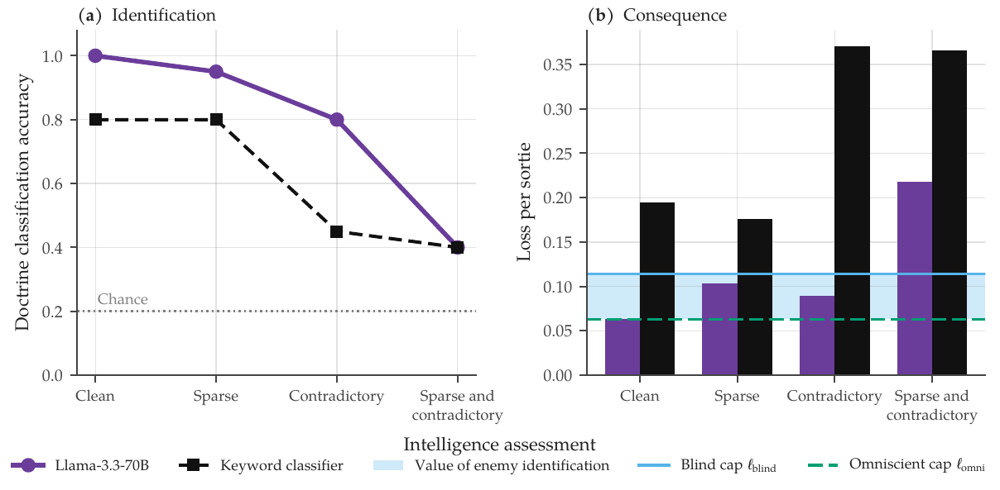

Where the adversary simply plays a static Nash equilibrium, simple randomised rules are
provably optimal. However, if the adversary observes and adapts, SACRED achieves evasion rates
that no solver or heuristic can match, and does so on completely unseen networks, on the ground
and in the air.

## Mission Control

Mission Control is the interactive deliverable of the thesis. The theatres, the trained
policies, and the experimental record are explorable through it. Every surface plays the
interdiction game, with exact solvers, with trained policies, and with the visitor.

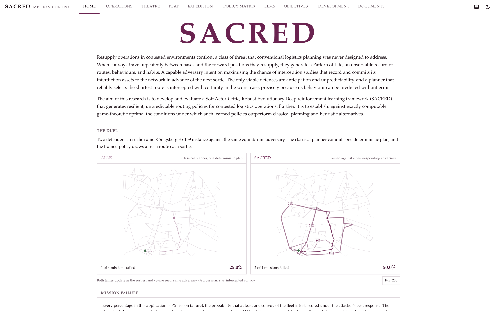

### Road Operations

Five defender strategies on one instance of the road interdiction game, each drawn as its route
marginal over the menu ℛ. Watch flies the fleet sortie by sortie against the committed
interdictor, Defend hands the routing to the visitor, and Attack hands them the interdiction
set. Every percentage on these screens is P(mission failure), the probability that at least one
convoy of the fleet is lost, scored under the attacker's best response.

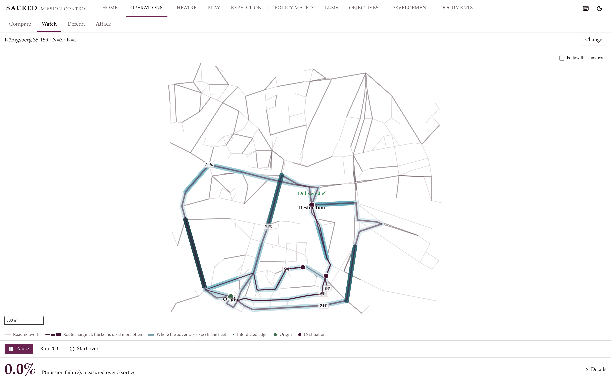

### Aerial Theatres

The four scored theatres, with the banked Königsberg Oblast replay. The adaptive air defences
re-aim to the fleet's recent serials, and the policy threads between the re-aimed line-of-sight
footprints. The flown route reddens where, and only where, it passes inside an interception
ring, in proportion to the lethality it collects there. Narva, Dnipro-Zaporizhzhia, and the
Fulda Gap are flown live, because nothing was ever trained on them; every number on those
screens is computed as you watch.

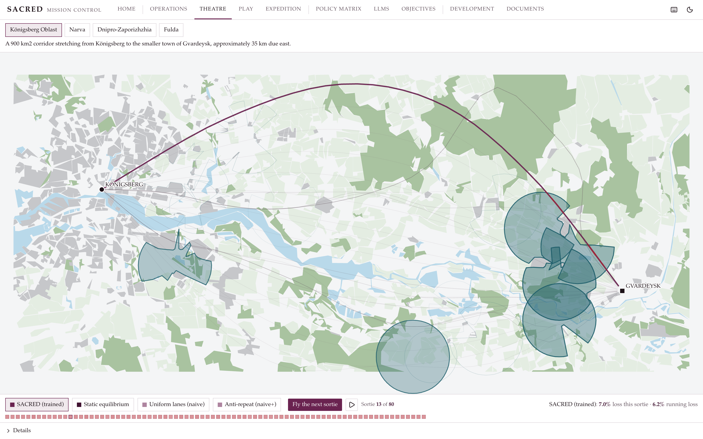

### Air Defence

Emplace the air defences yourself and fly the trained policy against them. Terrain governs each
site's reach, its lethality, and whether it is revealed to the defender once it engages, so the
attacker faces a genuine dilemma between lethality and concealment.

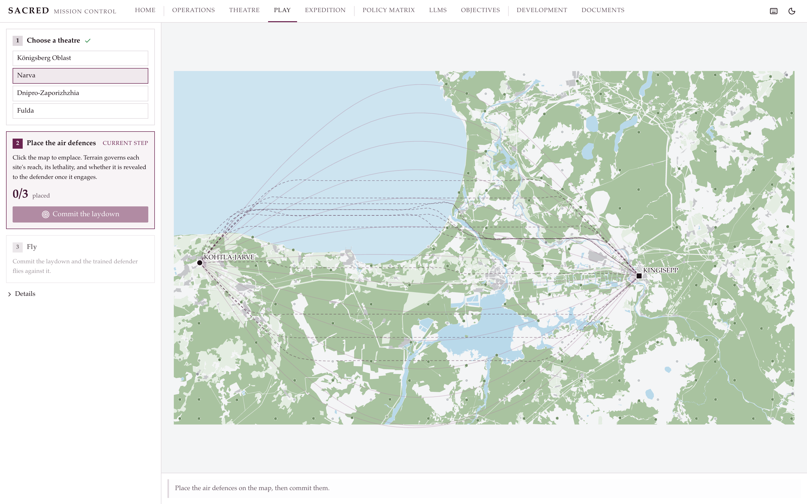

### Expedition

Drop an origin and a destination anywhere on the map. The application pulls that ground's
terrain from OpenStreetMap and builds a playable theatre from it.

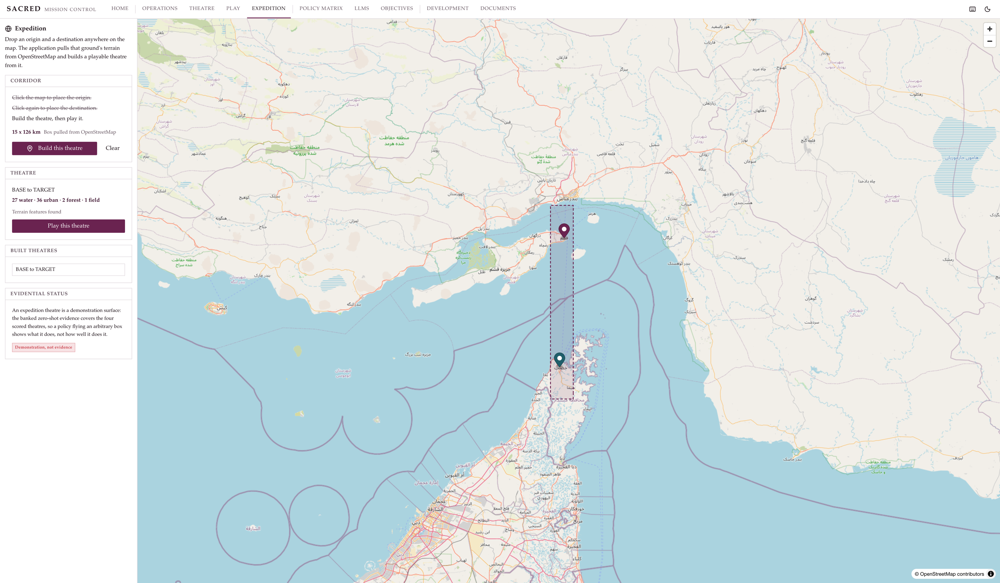

### Policy Matrix

A decision-maker must choose their defence based on the adversary they are facing. The matrix
states the recommended routing policy by adversary and interdiction budget K, and every cell
links to the surface or record that carries its evidence.

### Language Models

Where language models fail as routers, and where they measurably assist SACRED. Llama-3.3-70B
and Qwen3.6-27B both fail as decision-making defenders, yet they classify described enemy
doctrine perfectly and author strong training curricula at a sixteen-evaluation budget.

### SACRED's Development

The experiments of the thesis, presented in five distinct acts. Each act introduces the
question it is designed to answer and closes on the finding that acts as a bridge to the next
act. Every step stands on its experiment record, opened in place in the Documents reader.

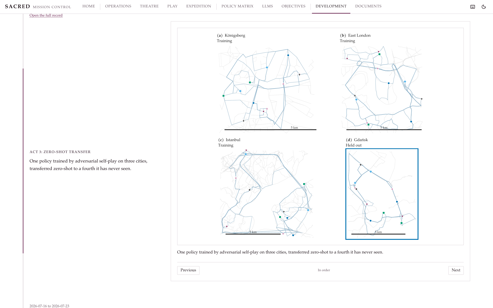

### Architecture

Three layers around one written record.

- `web/`, the frontend. React 19, TypeScript, Vite, TanStack Router, Tailwind, and MapLibre
  with a self-contained style. Surfaces are self-registering modules discovered at build time;
  the theatre scenes are hand-built SVG in kilometre coordinates.
- `api/`, the FastAPI service. Routers under `/api`, jobs for the long solves, WebSockets for
  the sortie streams, and, in production, the built web app served from the same origin.
- `sacred/`, the engine. The game definitions, the exact solvers, and the torch policies. Pure
  compute, reads `data/maps/` and `models/runs/`, writes nothing.
- `experiments/`, the record. One markdown record per experiment, stating the question, the
  pinned configuration, the pre-registered decision criteria, and the results.

Two properties carry the design. Every number quoted in the interface is re-verified against
the record it cites at request time, so the application cannot silently drift from the written
evidence. And every ladder is anchored to exactly computable optima, the LP value v\* of the
static game and the exact stationary loss ℓ\_dyn of the observant game, both pinned in the
test suite.

### Verification

- 90 Python tests over the engine contract, the oracle anchors, and every API route.
- 108 web tests. The screens render against the live API's own recorded payloads, so a field
  the server stopped sending fails a test instead of blanking a screen, and the map surfaces
  are additionally tested with WebGL unavailable.
- ruff and strict pyright on the Python layers, eslint and tsc on the web.
- CI runs the full set on every push.

## Code availability

The source code, the experiment records, and the Mission Control application are held in private
repositories while the work is prepared for publication with Dr Panagiotis Angeloudis at Imperial
College London. Access can be arranged on request.

## Data

Road graphs and theatre geometry derive from OpenStreetMap data, © OpenStreetMap contributors,
available under the Open Database Licence (ODbL).

## Copyright

Copyright © 2026 Kilian Schwarz. All rights reserved. The text and figures in this repository may
not be reproduced without permission.

## About

Kilian Xhen Schwarz, MSc Transport, Imperial College London. Supervised by Dr Panagiotis
Angeloudis. Further projects at [github.com/Kilian-S](https://github.com/Kilian-S).
